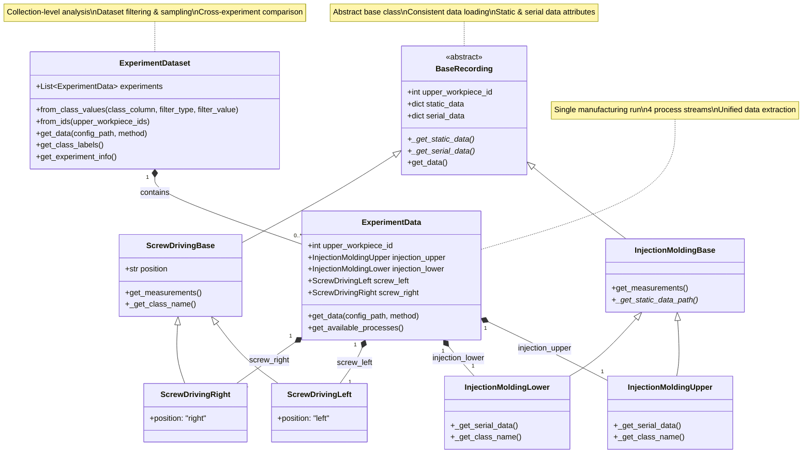

# Cross-Process Chain Error Detection

A comprehensive Python framework for **ProData error detection** across interconnected manufacturing processes, specifically designed for analyzing correlations between **injection molding** and **screw driving** operations in plastic component assembly.

## 🎯 Overview

This project enables cross-process analysis of manufacturing quality by combining time-series data from multiple production stages. It's particularly valuable for understanding how material properties and process parameters in early manufacturing stages (injection molding) affect downstream assembly operations (screw driving).

### Key Capabilities

- **Multi-Process Integration**: Unified analysis of injection molding and screw driving data
- **Flexible Data Extraction**: Support for raw data, statistical features (PAA, tsfresh, catch22)
- **Material Variation Studies**: Compare different recyclate contents, glass fiber percentages, and control conditions
- **Cross-Process Correlation**: Identify how upstream process variations affect downstream quality
- **Scalable Analysis**: From single experiments to large dataset comparisons

## 🏗️ Architecture

### Class Relationships



### Core Usage Pattern

```python
# Single manufacturing experiment (4 data streams)
experiment = ExperimentData(upper_workpiece_id=17401)

# Collection of experiments for comparative analysis  
dataset = ExperimentDataset.from_class_values(
    class_column="class_value_upper_work_piece",
    filter_type="contains", 
    filter_value="recyclate_content"
)
```

### Data Streams Per Experiment

1. **Upper Workpiece Injection Molding** (CSV files)
   - Time series: pressure target/actual, velocity, volume, state
   
2. **Lower Workpiece Injection Molding** (TXT files) 
   - Time series: pressure target/actual, velocity, volume
   
3. **Left Position Screw Driving** (JSON files)
   - Time series: torque, angle, gradient across tightening steps
   
4. **Right Position Screw Driving** (JSON files)
   - Time series: torque, angle, gradient across tightening steps

## 📊 Material Conditions Studied

- **Control Groups**: Reference materials for baseline comparisons
- **Recyclate Content**: 0%, 10%, 20%, 30%, 40% variations
- **Glass Fiber Content**: Various percentage reinforcements  
- **Process Conditions**: Different temperature and assembly parameters

## 🚀 Quick Start

### Basic Usage

```python
from schema import ExperimentData, ExperimentDataset

# Load single experiment
experiment = ExperimentData(upper_workpiece_id=17401)

# Access individual recordings
print(f"Upper injection data: {experiment.injection_upper.serial_data.keys()}")
print(f"Left screw data: {experiment.screw_left.serial_data.keys()}")

# Extract processed data
processed_data = experiment.injection_upper.get_data()
```

### Dataset Creation and Analysis

```python
# Create dataset for recyclate content study
recyclate_dataset = ExperimentDataset.from_class_values(
    class_column="class_value_upper_work_piece",
    filter_type="contains",
    filter_value="recyclate_content",
    sample_size=50
)

# Compare with control group
control_dataset = ExperimentDataset.from_class_values(
    class_column="class_value_upper_work_piece", 
    filter_type="exact",
    filter_value="control_group_01",
    sample_size=50
)

# Extract features from datasets
recyclate_features = recyclate_dataset.get_data()
control_features = control_dataset.get_data()
```

### Configuration-Based Feature Extraction

Configure processing and extraction using YAML files:

**processing.yml** - Data preprocessing:
```yaml
injection_molding:
  upper_workpiece:
    injection_pressure_target:
      apply_equal_lengths:
        target_length: 2048
        cutoff_position: post
        padding_val: 0.0
```

**extraction.yml** - Feature extraction:
```yaml
injection_molding:
  upper_workpiece:
    injection_pressure_target:
      use_series: true
      method: "raw"  # Options: raw, paa, tsfresh, catch22
    melt_volume:
      use_series: true
      method: "paa"
      paa_target_length: 200
```

## 📁 Project Structure

```
cross-process-chain-error-detection/
├── schema/
│   ├── recordings/
│   │   ├── base.py                    # BaseRecording abstract class
│   │   ├── injection_molding.py       # InjectionMoldingBase/Upper/Lower
│   │   └── screw_driving.py           # ScrewDrivingBase/Left/Right
│   └── experiment/
│       ├── data.py                    # ExperimentData (single experiment)
│       ├── dataset.py                 # ExperimentDataset (collections)
│       └── plotting.py                # Visualization utilities
├── settings/
│   ├── processing.yml                 # Data preprocessing configuration
│   └── extraction.yml                 # Feature extraction configuration
├── utils/
│   └── paths.py                       # Path utilities for data access
├── data/
│   ├── injection_molding/             # Static & serial data
│   ├── screw_driving/                 # Static & serial data
│   └── class_values.csv               # Experiment labels
└── notebooks/                         # Analysis examples
```

## 🔗 Related Resources

### Screw Driving Dataset Collection

The screw driving component of this project is part of a larger dataset collection:

- **📊 Dataset**: [Industrial Screw Driving Dataset Collection on Zenodo](https://zenodo.org/records/15393134)
  - 6 scenarios with 34,000+ screw driving operations
  - Covers thread degradation, surface friction, assembly conditions, and material variations
  - Complete time-series data with comprehensive dataset information

- **🐍 Python Library**: [PyScrew](https://github.com/nikolaiwest/pyscrew)
  - Streamlined access to the Zenodo screw driving datasets
  - Data validation, processing, and normalization utilities
  - Install with: `pip install pyscrew`

### Integration Example

```python
import pyscrew
from schema import ExperimentData

# Load screw driving data from PyScrew
screw_data = pyscrew.get_data(scenario="s05")

# Load corresponding injection molding data
experiment = ExperimentData(upper_workpiece_id=17401)
injection_data = experiment.injection_upper.serial_data

# Analyze correlations between processes
# ... your analysis code
```

## 🔬 Research Applications

### Cross-Process Quality Analysis
- Correlate injection molding parameters with screw driving performance
- Identify how material composition affects assembly quality
- Study process chain stability and error propagation

### Material Impact Studies  
- Compare recyclate vs. virgin material performance
- Analyze glass fiber reinforcement effects across processes
- Optimize material formulations for entire process chain

### Predictive Quality Modeling
- Develop early warning systems based on injection molding data
- Predict screw driving failures from upstream process parameters
- Create digital twins of complete manufacturing chains

## 📚 Feature Extraction Methods

| Method | Description | Use Case |
|--------|-------------|----------|
| `raw` | Original time series data | Direct analysis, custom processing |
| `paa` | Piecewise Aggregate Approximation | Dimensionality reduction, pattern recognition |
| `tsfresh` | Comprehensive statistical features | ML feature engineering, classification |
| `catch22` | Canonical time series characteristics | Standardized feature comparison |

## 🛠️ Installation & Requirements

```bash
# Clone the repository
git clone https://github.com/yourusername/cross-process-chain-error-detection
cd cross-process-chain-error-detection

# Install dependencies
pip install pandas numpy pyyaml matplotlib

# Optional: Install PyScrew for extended screw driving analysis
pip install pyscrew
```

## 📖 Usage Examples

### Data Access Patterns

```python
from schema import ExperimentData

# Load experiment
experiment = ExperimentData(upper_workpiece_id=17401)

# Access static data (measurements, metadata)
static_data = experiment.injection_upper.static_data
print(f"Class value: {static_data['class_value']}")
print(f"Measurements: {experiment.injection_upper.get_measurements()}")

# Access serial data (time series)
serial_data = experiment.injection_upper.serial_data
pressure_target = serial_data['injection_pressure_target']
pressure_actual = serial_data['injection_pressure_actual']

# Plot experiment data
experiment.plot_data()
```

### Advanced Dataset Analysis

```python
from schema import ExperimentDataset

# Create comparative datasets
datasets = {
    'control': ExperimentDataset.from_class_values(
        filter_type="exact", filter_value="control_group_01"
    ),
    'recyclate_20': ExperimentDataset.from_class_values(
        filter_type="contains", filter_value="recyclate_content_20"
    ),
    'recyclate_40': ExperimentDataset.from_class_values(
        filter_type="contains", filter_value="recyclate_content_40"
    )
}

# Extract features for all datasets
features = {}
for name, dataset in datasets.items():
    features[name] = dataset.get_data()
    print(f"{name}: {features[name].shape[0]} experiments")
```

## 🤝 Contributing

This project follows simple, best-practice approaches without over-engineering. Contributions are welcome for:

- Additional feature extraction methods
- New analysis utilities
- Documentation improvements
- Test coverage expansion

## 📄 Citation

When using this framework in research, please cite:

- This repository for the cross-process analysis framework
- The [Zenodo dataset](https://zenodo.org/records/15393134) for screw driving data
- Relevant papers mentioned in the [PyScrew documentation](https://github.com/nikolaiwest/pyscrew)

## 🏛️ Acknowledgments

This framework was developed for manufacturing analytics research, building upon:
- Industrial datasets from RIF Institute for Research and Transfer e.V.
- Research collaboration with Technical University Dortmund, Institute for Production Systems
- The broader PyScrew ecosystem for screw driving analysis

---

**Note**: This project focuses on cross-process analysis combining injection molding and screw driving data. For dedicated screw driving analysis, use the [PyScrew library](https://github.com/nikolaiwest/pyscrew) and [Zenodo datasets](https://zenodo.org/records/15393134).