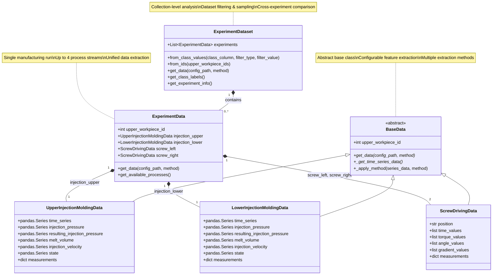

# Cross-Process Chain Error Detection

A comprehensive Python framework for **ProData error detection** across interconnected manufacturing processes, specifically designed for analyzing correlations between **injection molding** and **screw driving** operations in plastic component assembly.

## 🎯 Overview

This project enables cross-process analysis of manufacturing quality by combining time-series data from multiple production stages. It's particularly valuable for understanding how material properties and process parameters in early manufacturing stages (injection molding) affect downstream assembly operations (screw driving).

### Key Capabilities

- **Multi-Process Integration**: Unified analysis of injection molding and screw driving data
- **Flexible Data Extraction**: Support for raw data, statistical features (PAA, tsfresh, catch22)
- **Material Variation Studies**: Compare different recyclate contents, glass fiber percentages, and control conditions
- **Cross-Process Correlation**: Identify how upstream process variations affect downstream quality
- **Scalable Analysis**: From single experiments to large dataset comparisons

## 🏗️ Architecture

### Class Relationships



### Core Usage Pattern

```python
# Single manufacturing experiment (up to 4 data streams)
experiment = ExperimentData(upper_workpiece_id=17401)

# Collection of experiments for comparative analysis  
dataset = ExperimentDataset.from_class_values(
    class_column="class_value_upper_work_piece",
    filter_type="contains", 
    filter_value="recyclate_content"
)
```

### Data Streams Per Experiment (and sources)

1. **Upper Workpiece Injection Molding** (CSV)
   - Time series: pressure, velocity, volume, temperature
   
2. **Lower Workpiece Injection Molding** (TXT) 
   - Time series: pressure, velocity, volume, temperature
   
3. **Left Position Screw Driving** (JSON)
   - Time series: torque, angle, gradient across tightening steps
   
4. **Right Position Screw Driving** (JSON)
   - Time series: torque, angle, gradient across tightening steps

## 📊 Material Conditions Studied (examples)

- **Control Groups**: Reference materials for baseline comparisons
- **Recyclate Content**: 0%, 10%, 20%, 30%, 40% variations
- **Glass Fiber Content**: Various percentage reinforcements  
- **Process Conditions**: Different temperature and assembly parameters

## 🚀 Quick Start

### Basic Usage

```python
from schema.experiment_data import ExperimentData
from schema.experiment_dataset import ExperimentDataset

# Load single experiment
experiment = ExperimentData(upper_workpiece_id=17401)
print(f"Available processes: {experiment.get_available_processes()}")

# Extract raw data from all processes
raw_data = experiment.get_data(method="raw")

# Extract features using configuration
featured_data = experiment.get_data(config_path="settings.yml")
```

### Dataset Creation and Analysis

```python
# Create dataset for recyclate content study
recyclate_dataset = ExperimentDataset.from_class_values(
    class_column="class_value_upper_work_piece",
    filter_type="contains",
    filter_value="recyclate_content",
    sample_size=50
)

# Compare with control group
control_dataset = ExperimentDataset.from_class_values(
    class_column="class_value_upper_work_piece", 
    filter_type="exact",
    filter_value="control_group_01",
    sample_size=50
)

# Extract data from entire datasets
recyclate_features = recyclate_dataset.get_data(config_path="settings.yml")
control_features = control_dataset.get_data(config_path="settings.yml")
```

### Configuration-Based Feature Extraction

Create a `settings.yml` file to define feature extraction:

```yaml
extraction:
  injection_upper:
    injection_pressure:
      use_series: true
      method: "paa"
      segments: 20
      normalize: true
    melt_volume:
      use_series: true  
      method: "tsfresh"
      normalize: false
      
  screw_left:
    torque:
      use_series: true
      method: "catch22"
      normalize: true
    angle:
      use_series: true
      method: "paa"
      segments: 10
```

## 📁 Project Structure

```
cross-process-chain-error-detection/
├── schema/
│   ├── base_data.py           # Abstract base with feature extraction
│   ├── experiment_data.py     # Single experiment (4 processes)
│   ├── experiment_dataset.py  # Multiple experiments collection
│   ├── injection_molding.py   # Upper/lower injection molding classes
│   └── screw_driving.py       # Left/right screw driving classes
├── data/
│   ├── injection_molding/     # Injection molding serial data and static data 
│   ├── screw_driving/         # Screw driving time series + static data   
│   └── class_values.csv       # Experiment labels and conditions
├── settings.yml               # Feature extraction configuration
└── main.py                   # Usage examples and testing
```

## 🔗 Related Resources

### Screw Driving Dataset Collection

The screw driving component of this project is part of a larger dataset collection:

- **📊 Dataset**: [Industrial Screw Driving Dataset Collection on Zenodo](https://zenodo.org/records/15393134)
  - 6 scenarios with 34,000+ screw driving operations
  - Covers thread degradation, surface friction, assembly conditions, and material variations
  - Complete time-series data with comprehensive dataset information

- **🐍 Python Library**: [PyScrew](https://github.com/nikolaiwest/pyscrew)
  - Streamlined access to the Zenodo screw driving datasets
  - Data validation, processing, and normalization utilities
  - Install with: `pip install pyscrew`

### Integration Example

You can combine this cross-process framework with PyScrew for extended analysis:

```python
import pyscrew
from schema.experiment_data import ExperimentData

# Load screw driving data from PyScrew
screw_data = pyscrew.get_data(scenario="s05")  # Upper workpiece variations

# Load corresponding injection molding data
experiment = ExperimentData(upper_workpiece_id=17401)
injection_data = experiment.injection_upper.get_data(method="raw")

# Analyze correlations between processes
# ... your analysis code
```

## 🔬 Research Applications

### Cross-Process Quality Analysis
- Correlate injection molding parameters with screw driving performance
- Identify how material composition affects assembly quality
- Study process chain stability and error propagation

### Material Impact Studies  
- Compare recyclate vs. virgin material performance
- Analyze glass fiber reinforcement effects across processes
- Optimize material formulations for entire process chain

### Predictive Quality Modeling
- Develop early warning systems based on injection molding data
- Predict screw driving failures from upstream process parameters
- Create digital twins of complete manufacturing chains

## 📚 Feature Extraction Methods

| Method | Description | Use Case |
|--------|-------------|----------|
| `raw` | Original time series data | Direct analysis, custom processing |
| `paa` | Piecewise Aggregate Approximation | Dimensionality reduction, pattern recognition |
| `tsfresh` | Comprehensive statistical features | ML feature engineering, classification |
| `catch22` | Canonical time series characteristics | Standardized feature comparison |

## 🛠️ Installation & Requirements

```bash
# Clone the repository
git clone https://github.com/yourusername/cross-process-chain-error-detection
cd cross-process-chain-error-detection

# Install dependencies
pip install pandas numpy pyyaml

# Optional: Install PyScrew for extended screw driving analysis
pip install pyscrew
```

## 📖 Usage Examples

See `main.py` for comprehensive examples including:
- Single experiment analysis
- Dataset creation with different filtering strategies  
- Cross-experiment comparative studies
- Configuration-based feature extraction
- Material condition comparisons

## 🤝 Contributing

This project follows simple, best-practice approaches without over-engineering. Contributions are welcome for:

- Additional feature extraction methods
- New analysis utilities
- Documentation improvements
- Test coverage expansion

## 📄 Citation

When using this framework in research, please cite:

- This repository for the cross-process analysis framework
- The [Zenodo dataset](https://zenodo.org/records/15393134) for screw driving data
- Relevant papers mentioned in the [PyScrew documentation](https://github.com/nikolaiwest/pyscrew)

## 📞 Contact

For questions about this cross-process framework or collaboration opportunities:
- Create an issue in this repository
- Contact details available in related publications

## 🏛️ Acknowledgments

This framework was developed for manufacturing analytics research, building upon:
- Industrial datasets from RIF Institute for Research and Transfer e.V.
- Research collaboration with Technical University Dortmund, Institute for Production Systems
- The broader PyScrew ecosystem for screw driving analysis

---

**Note**: This project focuses on cross-process analysis combining injection molding and screw driving data. For dedicated screw driving analysis, use the [PyScrew library](https://github.com/nikolaiwest/pyscrew) and [Zenodo datasets](https://zenodo.org/records/15393134).